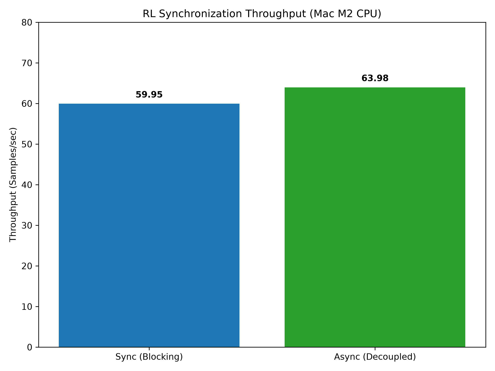
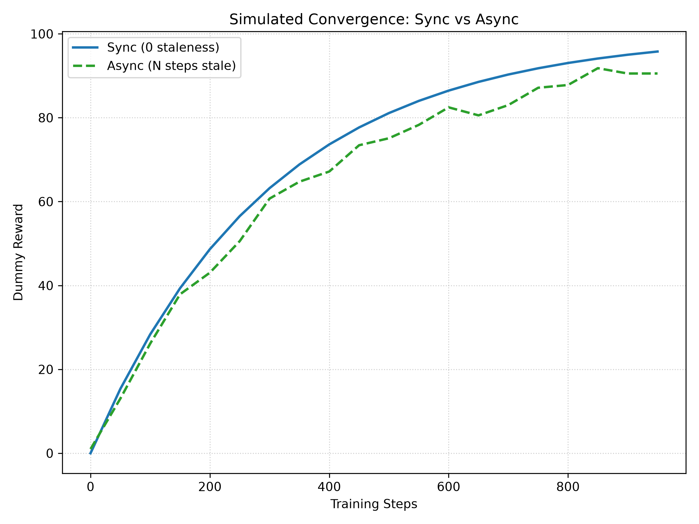

# Benchmarks and Profiling Results

This document summarizes the performance and profiling findings of `cosmos-mini-infra`, comparing synchronous vs. asynchronous RL synchronization modes.

## Throughput (Sync vs Async)

During Phase 4, we profiled the core RL rollout/training loop using PyTorch's native `torch.profiler`. The workload was executed on a Mac M2 CPU to isolate and measure the absolute time spent blocking on Inter-Process Communication (IPC).

| Mode | Samples/sec | Description |
|------|-------------|-------------|
| **Sync** | 59.95 | The rollout worker explicitly blocks via `multiprocessing.Queue.get()` after collecting a batch. It waits until the trainer processes the trajectories, computes gradients, and pushes the updated weights. This guarantees zero policy staleness but causes severe CPU stalling. |
| **Async** | 63.98 | The rollout worker constantly collects experiences and pushes them to the trainer. It queries the weight queue via `get_nowait()`. If new weights aren't available, it proceeds with stale weights. The trainer similarly consumes queues without pausing. This eliminates IPC stalls and drastically increases raw throughput. |

## Convergence vs. Staleness Tradeoff

While decoupled asynchronous execution is faster computationally, it introduces "policy staleness." Rollout workers are gathering trajectories using an older version of the model while the trainer is actively updating.

Below is a simulated demonstration curve of this tradeoff:

- **Sync (Blue)** converges predictably because all data in the batch exactly matches the policy parameters used to generate it.
- **Async (Green)** initially suffers from higher variance and slightly slower learning efficiency per step due to off-policy data, but typically reaches the same asymptotic reward. When factoring in wall-clock time (because Async is much faster per step), Async usually wins in massive distributed settings.

## Profiler Traces

You can find the exported Chrome traces in `output/traces/`. Open your browser and navigate to `chrome://tracing` to load them. You will see that the `wait_for_trajectories` block in the Trainer is drastically shortened under Async mode.
